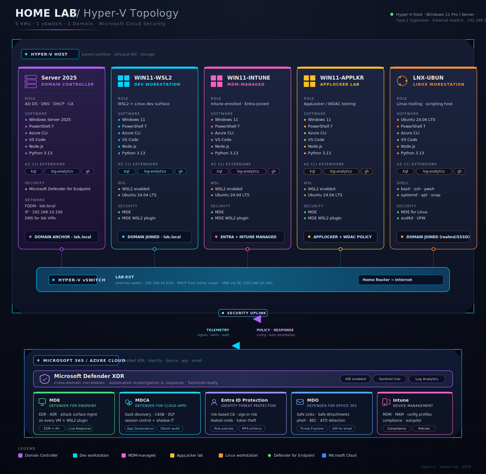

# Hyper-V Home Lab

This workspace documents and automates a repeatable Hyper-V home lab for Windows endpoint security, Intune, MDE, WSL2, Docker, AppLocker, Active Directory, Azure CLI/KQL tooling, and Linux automation testing.

The lab is built around deterministic VM provisioning: the VM name is carried into the VM folder, VHD names, logs, reports, and template specs; nested virtualization and nested networking are enabled before first boot; and post-create validation must pass before a build is considered successful.

## Lab Topology



## VM Roles

| VM | OS | Purpose |
| --- | --- | --- |
| `Server 2025 (DC)` | Windows Server 2025 | Domain controller for AD DS, DNS, GPO, and identity-policy testing. |
| `WIN11-WSL2` | Windows 11 Enterprise | Source/reference Windows workstation profile and WSL2/Docker developer endpoint. |
| `WIN11-INTUNE` | Windows 11 Enterprise | Intune-enrolled endpoint for MDE, Azure tooling, KQL, and policy validation. |
| `WIN11-APPLKR` | Windows 11 Enterprise | AppLocker and WDAC testing workstation for application-control scenarios. |
| `LNX-UBUN` | Ubuntu 24.04 | Linux automation, scripting, and cross-platform security tooling. |

## Windows VM Software Baseline

Install this baseline on the Windows 11 lab VMs unless a VM-specific role says otherwise:

| Category | Software |
| --- | --- |
| Shells and scripting | PowerShell 7, Python 3.13 |
| Azure tooling | Azure CLI, Az PowerShell module for PowerShell 7 |
| Azure CLI extensions | Kusto/KQL extension, Log Analytics extension |
| Developer tooling | GitHub CLI (`gh`), Node.js current release, Visual Studio Code |
| VS Code extensions | PowerShell, Python, Azure CLI, Azure Account, Kusto/KQL |
| WSL and containers | WSL enabled, Ubuntu 24.04 installed under WSL, Docker Desktop with WSL2 backend |
| Security | Microsoft Defender for Endpoint onboarded, MDE plugin for WSL2 installed |

Enable WSL and the virtualization platform inside Windows 11 lab VMs:

```powershell
Enable-WindowsOptionalFeature -Online -FeatureName Microsoft-Windows-Subsystem-Linux -All
Enable-WindowsOptionalFeature -Online -FeatureName VirtualMachinePlatform -All
wsl --install -d Ubuntu-24.04
wsl --set-default-version 2
```

Install `gh` as the GitHub CLI. It is listed next to Azure CLI tooling because it is part of the lab command-line baseline, not because it is an Azure CLI extension.

The `Server 2025 (DC)` VM should prioritize AD DS, DNS, Group Policy Management, and Windows administration tools. Install the developer baseline there only when it supports a specific lab scenario.

## Build Documents

- [docs/VM-Build.md](docs/VM-Build.md) covers repeatable Hyper-V VM provisioning, validation, Intune enrollment, and clone guidance.
- [scripts/Provision-Win11HyperVVM.ps1](scripts/Provision-Win11HyperVVM.ps1) is the primary provisioning entrypoint.
- [scripts/Test-HyperVVmProvision.ps1](scripts/Test-HyperVVmProvision.ps1) is the deterministic post-create validation gate.

## Provision A Windows VM

From PowerShell on the Hyper-V host:

```powershell
Set-Location "C:\Users\Lorenzo\Documents\Win11_Intune_Project"
.\scripts\Provision-Win11HyperVVM.ps1 -VMName "WIN11-INTUNE"
```

To create the AppLocker workstation later:

```powershell
.\scripts\Provision-Win11HyperVVM.ps1 -VMName "WIN11-APPLKR"
```

The entrypoint self-elevates when needed. Approve the UAC prompt so it can create the VM, create the VHDX, attach the ISO, configure TPM, enable nested virtualization, enable MAC address spoofing, and run validation.

## Provisioning Success Criteria

Provisioning is successful only when the validation report passes immediately after creation and before first boot.

The validation suite checks:

- VM exists and remains powered off.
- Hyper-V VM ID is unique from the source VM.
- VM generation, CPU, memory, firmware, Secure Boot, TPM, integration services, switch, and VLAN match the source profile.
- Nested virtualization is enabled.
- MAC address spoofing is enabled on every VM network adapter.
- MAC addresses are unique from the source VM.
- VHD files are new, sized like the source disks, and named with the target VM name.
- Windows install ISO is attached.

Validation reports are written to `reports\*.validation.json`; transcripts are written to `logs\*.log`.